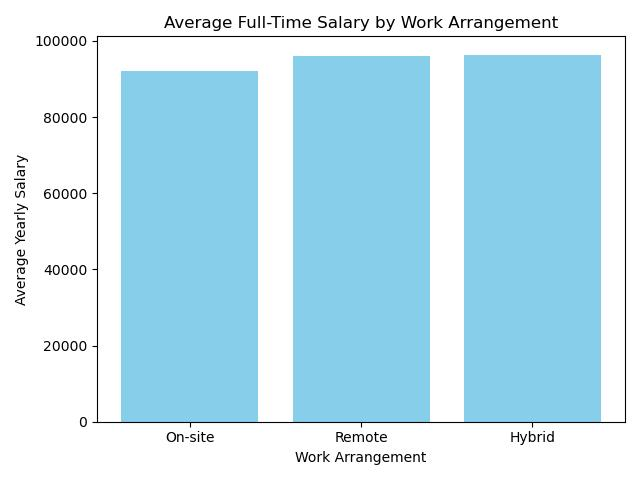
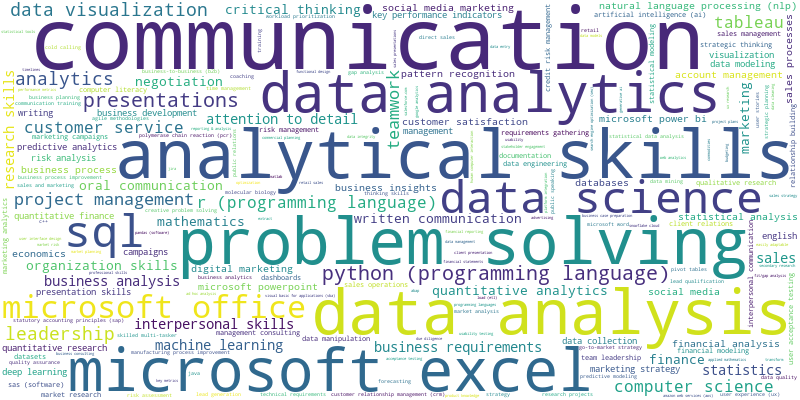

# Wage and Skill Analysis of Economics Major Career Choices from LinkedIn Jobs

## Data  

In this project, we collected the data from LinkdIn website. And the data involved 8 types of jobs: consulting, data scientist, business analyst, data analyst, marketing, sales, researcher, risk analyst, which are highly related to the economics major. Finally, we totally collected 16354 job positions, including the name of position, location, salary, time post, required skills, work arrangement, and employment types. 

 
### Data Collection Method

We used Selenium to interact with the LinkedIn website, simulating user actions such as logging in, searching, and navigating job listings. Job listings were scraped automatically for each job title, with the data processed iteratively, moving from page to page until all listings for that title were collected. Since LinkedIn provides a maximum of 40 pages of data per search keyword, we used our LinkedIn account to gather additional data, which was merged to create a more comprehensive dataset.

After scraping the data three times, we merged all the collected data and removed duplicate job postings. We then processed key fields such as location, salary, work arrangement, and employment type to generate the final clean_data dataset.

### Limitation of the Data
 
First, LinkedIn restricts the data to a maximum of 40 pages per search keyword, which limits our ability to collect all relevant job postings. This limitation affects our analysis and may introduce bias into the results.

Second, our data collection was limited to LinkedIn. To provide a more comprehensive view, data from other platforms such as Handshake, Indeed, and ZipRecruiter could be included for comparison.

Third, some job postings on LinkedIn contain inaccurate or unrealistic information, such as salary ranges from $1 to $300,000, which can skew the analysis.

Lastly, in our cluster analysis, we used GPT for classification. However, the classification results were not entirely accurate, and we only manually verified a portion of the data.

### Extention of the Data

First, we can expand the size of our dataset to improve the accuracy of our analysis.

Second, in our salary study, we analyzed only the absolute salary values without considering the local cost of living or regional wage levels. Incorporating data such as the Consumer Price Index (CPI) or average regional salary statistics provided by government sources would offer more context to the analysis.

Third, in the salary analysis, we used histograms to represent wage differences across states. A more intuitive approach would be to use a geographical map with heatmaps to visually depict salary variations across regions.

Lastly, in the cluster analysis, we used the K-means method, but the results were highly dependent on the number of clusters, and some clusters were quite similar. For lower-dimensional feature data, alternative clustering methods may provide better results.

### Descriptive Summary

Using our revised dataset along with Pandas and Matplotlib, the results indicated that different search keys produced varying numbers of job listings on LinkedIn. The analysis showed that using "data analyst" as the search key yielded the highest search result of 2,295 listings, whereas "business analyst" generated the lowest result of 1,868 listings.

| Search Key       | Counts |
|:----------------:|:------:|
| Data Analyst     | 2295   |
| Risk Analyst     | 2117   |
| Consulting       | 2084   |
| Researcher       | 2070   |
| Sales            | 2008   |
| Data Scientist   | 1993   |
| Marketing        | 1918   |
| Business Analyst | 1868   |

   

## Salary Analysis

The primary goal of this project was to use the scraped data from LinkedIn to provide economics major students with valuable insights into choosing their careers, job locations. We divided the salary analysis into three parts to examine how job types, job location (at the state level), and work arrangements influenced salary levels for full-time positions.

### Job Types

The results indicated that data scientists had the highest average salary, earning $121,267.80, while business analysts had the lowest average salary among the eight job titles commonly searched by economics students. Despite having the lowest salary, business analysts were closely followed by marketing and sales positions, showing little difference in average salary.

| Search Key        | Average Salary  |
|:-----------------:|:---------------:|
| Data Scientist    | 121,267.80      |
| Researcher        | 112,241.14      |
| Consulting        | 101,753.06      |
| Data Analyst      | 96,346.48       |
| Risk Analyst      | 87,508.73       |
| Marketing         | 82,477.87       |
| Sales             | 82,339.85       |
| Business Analyst  | 81,569.23       |

### Job Locations

When analyzing salaries by state, California (CA) had the highest average salary at $106,932.28, while Kansas (KS) had the lowest at $40,250. Iowa (IA) reported the second-highest average salary at $105,000, which seemed counterintuitive. This may have been due to the limited number of job listings in Iowa, leading to a smaller dataset, or because the jobs listed on LinkedIn for Iowa were predominantly high-paying roles. 

To provide a more accurate representation of how salary levels vary by state, it would be ideal to adjust these figures based on the cost of living in each state. Specifically, incorporating the Consumer Price Index (CPI) for each state would allow us to compare real purchasing power across different regions, offering a clearer picture of how far a salary can stretch depending on location. For instance, a salary in a state with a lower CPI might offer greater purchasing power than a seemingly higher salary in a state with a high CPI, such as California.However, due to the lack of readily available data on state-specific CPI and constraints in time, this adjustment was not made in our analysis. Future research or analyses could benefit significantly from including such factors, providing a more nuanced understanding of salary levels and the true economic opportunities available across different states.

| State | Salary (Yearly) | State | Salary (Yearly) |
|:-----:|:---------------:|:-----:|:---------------:|
| CA    | 106,932.28       | ID    | 81,934.67       |
| IA    | 105,000.00       | RI    | 80,933.33       |
| MT    | 104,217.89       | PA    | 80,222.64       |
| NY    | 103,135.21       | MO    | 79,627.06       |
| DC    | 102,366.82       | CO    | 79,580.59       |
| LA    | 99,107.14        | AZ    | 79,097.53       |
| IL    | 98,382.10        | OR    | 79,087.03       |
| WA    | 95,488.12        | VA    | 78,511.73       |
| GA    | 95,387.64        | UT    | 76,002.18       |
| NJ    | 94,410.91        | MD    | 74,070.76       |
| MN    | 90,923.13        | IN    | 73,251.60       |
| AR    | 90,853.13        | SC    | 72,919.62       |
| DE    | 90,631.43        | ND    | 72,624.00       |
| HI    | 89,910.00        | WI    | 72,383.89       |
| TX    | 87,890.95        | ME    | 70,546.86       |
| NC    | 87,035.55        | MI    | 68,841.55       |
| CT    | 86,618.26        | NM    | 68,000.00       |
| FL    | 83,940.83        | WY    | 68,000.00       |
| WV    | 83,567.86        | NV    | 66,393.75       |
| MA    | 83,349.49        | AL    | 65,682.52       |
| TN    | 82,383.64        | NH    | 63,333.33       |
| OH    | 82,335.94        | AK    | 62,689.00       |
| KY    | 56,871.30        | OK    | 61,102.63       |
| MS    | 55,000.00        | NE    | 52,833.33       |
| VT    | 52,760.00        | KS    | 40,250.00       |

### Work Arrangement

We also analyzed whether work arrangements affected salary levels, focusing on the three main types of arrangements: on-site, remote, and hybrid. The results suggested that on-site jobs had the lowest average salary at $91,970.53. In contrast, remote and hybrid work arrangements showed higher average salaries, with remote jobs averaging $96,039.93 and hybrid jobs averaging $96,368.86. This difference could be attributed to several factors. For remote jobs, companies often save on costs related to maintaining office spaces, utilities, and supplies. These savings might enable them to offer more competitive salaries to attract and retain top talent.

| Work Arrangement | Average Salary  |
|:----------------:|:---------------:|
| On-site          | 91,970.53        |
| Remote           | 96,039.93        |
| Hybrid           | 96,368.86        |

  

## Skill Analysis

### Skills Word Cloud Based on Job Types

To generate the word cloud, we first created a dictionary where the keys represented different skills required by the job positions listed on LinkedIn, and the values were the counts of each skill. We then used the WordCloud package to visualize the word counts.The results suggested that overall, "communication," "analytical skills," and "problem-solving" were the most frequently occurring skills across all job types. The word clouds showed little variation between different job types. Therefore, we further examined the required skill sets for each job by using k-means clustering to determine which job types were associated with specific skill sets.

  <strong>Word Cloud 1: All the Job Types</strong>
   
  

| **Word Cloud 2: Business Analyst** | **Word Cloud 3: Consulting** |
|:-------------------------------:|:------------------------------:|
|  |  |

| **Word Cloud 4: Data Analyst** | **Word Cloud 5: Data Scientist** |
|:-------------------------------:|:------------------------------:|
|  |  |

| **Word Cloud 6: Marketing** | **Word Cloud 7: Researcher** |
|:-------------------------------:|:------------------------------:|
|  |  |

| **Word Cloud 8: Risk Analyst** | **Word Cloud 9: Sales** |
|:-------------------------------:|:------------------------------:|
|  |  |

### K-means Analysis for Job Types

K-means cluster analysis is an unsupervised method that we used to categorize various job types (Data Analyst, Data Scientist, Consulting, etc.) into three skill categories (soft skills, professional skills, coding skills) based on the skills most frequently required.

From this analysis, we can better assist economics students in making informed career choices. By classifying job types, students can select a career path that aligns with their strengths.

#### Methodology for K-means

We used unsupervised machine learning for clustering. First, we tokenized each skill into one of three categories: soft skills, professional skills, and coding skills. Some examples of our tokenization are listed in the table below, and the full tokenization CSV file is included in the results folder. The five most frequently used skills overall were communication, analytical skills, and problem-solving, which we categorized as soft skills.

| Skills           | Skill_Type     | Count |
|:----------------:|:--------------:|:-----:|
| Communication    | Soft           | 9385  |
| Analytical Skill | Soft           | 5136  |
| Problem Solving  | Soft           | 4630  |
| Data Analysis    | Professional   | 4405  |
| Microsoft Excel  | Coding         | 4129  |

Next, we calculated the number of occurrences of each skill type in each job post. Based on this, we assigned cluster centroids and reran the process multiple times to calculate the SSE (sum of squared errors) and determine the optimal number of clusters. In this case, we selected 5 as the optimal number of clusters.

  

We then clustered each job post into 5 groups and plotted a radar chart of the cluster centers to highlight the differences between them. We also counted the number of job types in each cluster to determine which cluster each job type belongs to.

#### Finding & Analysis

Below is the radar chart of the cluster centers. We can see that Cluster 2 focuses primarily on soft skills (e.g., communication, problem-solving, etc.), Cluster 3 emphasizes professional skills (e.g., economics, mathematics, etc.), and Cluster 0 contains jobs that mostly require coding skills (e.g., SQL, R, etc.).

  

The table below shows the number of job posts in each cluster based on job types and assigns each job type to a specific cluster. From this, we can see that only Cluster 0, Cluster 2, and Cluster 3 have been assigned job types.

| Search_Key       | 0     | 1     | 2     | 3     | 4     | Cluster |
|:----------------:|:-----:|:-----:|:-----:|:-----:|:-----:|:-------:|
| business analyst | 283   | 290   | 357   | 643   | 295   | 3       |
| consulting       | 306   | 465   | 744   | 477   | 92    | 2       |
| data analyst     | 648   | 51    | 321   | 738   | 537   | 3       |
| data scientist   | 801   | 29    | 108   | 498   | 557   | 0       |
| marketing        | 302   | 409   | 499   | 673   | 35    | 3       |
| researcher       | 548   | 289   | 438   | 575   | 220   | 3       |
| risk analyst     | 480   | 364   | 406   | 653   | 214   | 3       |
| sales            | 131   | 490   | 1114  | 247   | 26    | 2       |

The results of this analysis are largely in line with our expectations. From this analysis, we determined that business analysts belong to Cluster 3, which focuses on professional skills, including knowledge of accounting principles, economics, and mathematics. This suggests that companies expect their business analysts to have a strong background in professional knowledge. Students with high GPAs may have a higher chance of entering the business analyst field.

We also found that careers in consulting predominantly require soft skills, such as communication and problem-solving. This highlights the nature of consulting work, where professionals must communicate effectively with clients and present deliverables clearly.

Lastly, data scientists require the most coding skills compared to other career fields. This suggests that students who want to pursue a career as a data scientist should consider taking additional coding courses. Some of the commonly used programming languages in this field include SQL, R, and Python.

## Instruction to Rerun

### Analysis code

First, ensure that all the packages listed in the requirements.txt file are installed.
Next, run python code/clean_data.py to generate the cleaned dataset.
After that, run python code/data_analysis.py to obtain the analysis results.
Finally, run python code/cluster_prediction.py to produce the K-means clustering results.

All results will be stored in the results folder.

### Scrape code

Running the scrape code takes a long time, approximately 18 hours. We have already uploaded the data to GitHub, located in the 'data/rawdata' folder. If you need to run the web scraping code, there may be unexpected errors such as browser freezing or network delays. In such cases, you will need to resume the process from the current search_key.
